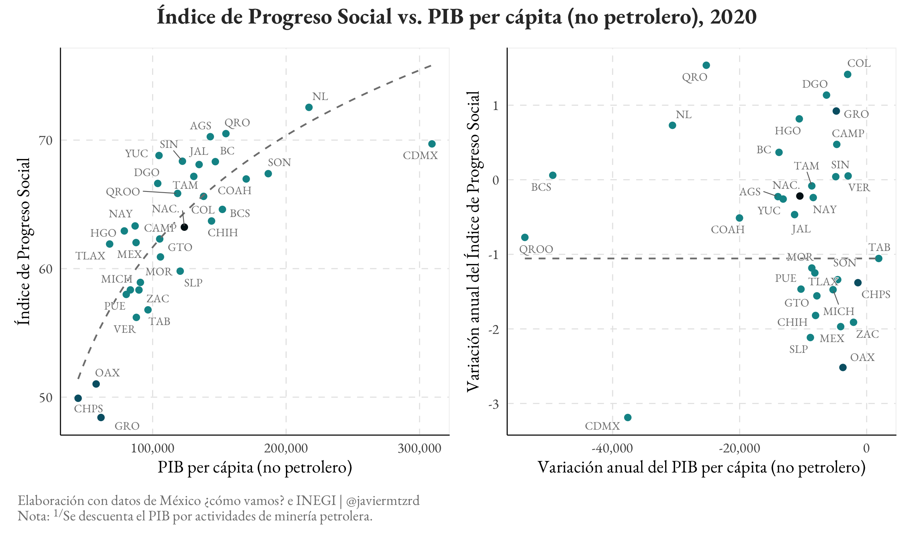

<!-- README.md is generated from README.Rmd. Please edit that file -->

```{r, include = FALSE}
knitr::opts_chunk$set(
  collapse = TRUE,
  comment = "#>"
)
```

# Progreso y retroceso social en el sureste mexicano <span style='color:#4f4f4f; font-size:large'>[Social Progress and Regression in the Mexican Southeast]</span>

This repository contains the code for generating the plots used in [Martínez Rodríguez, Javier. "Progreso y Retroceso Social en el Sureste Mexicano." Nexos (Pacto Federal), May 18, 2022](https://federalismo.nexos.com.mx/2022/05/progreso-y-retroceso-social-en-el-sureste-mexicano/).

{fig-align="center" width="550"}

* The text discusses the limitations of using economic indicators such as GDP per capita to evaluate the quality of life in the southeastern region of Mexico, specifically Oaxaca, Chiapas, and Guerrero.
* It argues that for a more complete understanding of the quality of life in this region, it is necessary to examine its economic situation and complement it with measures focused on evaluating human development, such as the <a href="https://github.com/mexicocomovamos/ips">IPS (Social Progress Index)</a> of Mexico.
* **This analysis was performed using R to process the IPS data and create the visualizations.**


